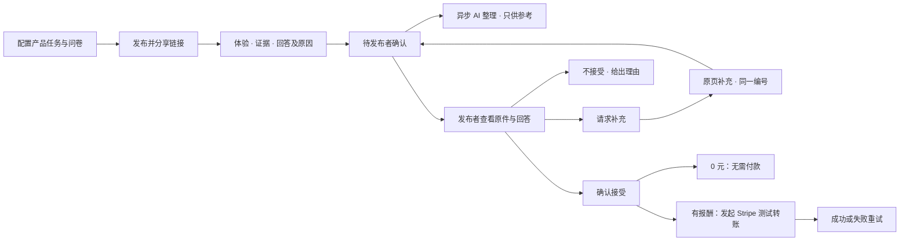
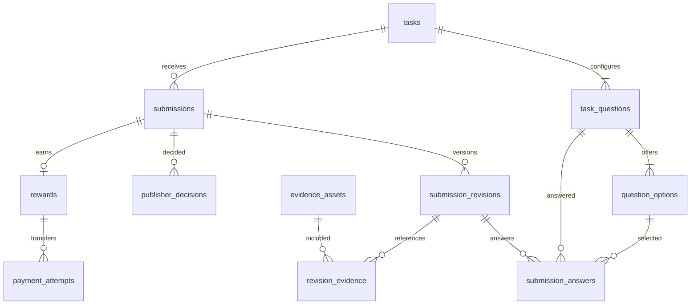
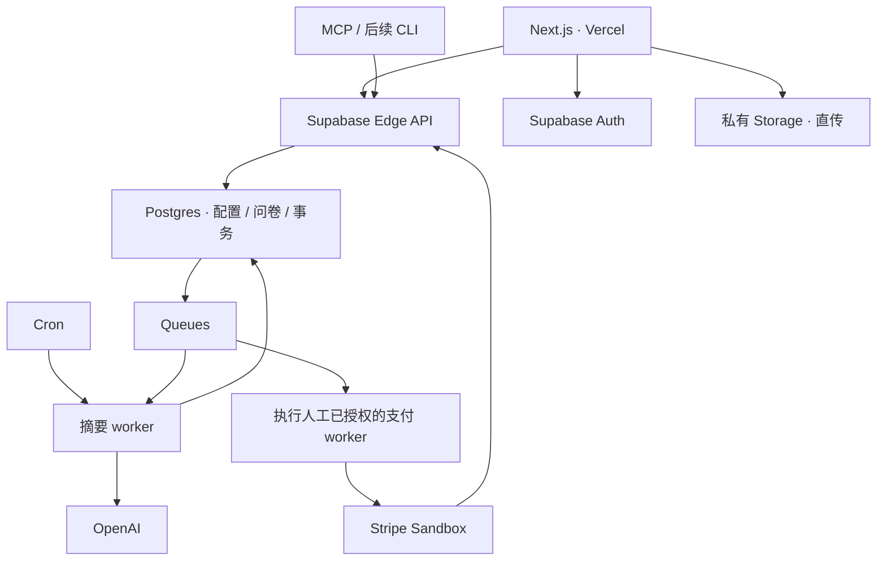

# 真人产品体验反馈平台 — 产品与技术 Spec

版本：v0.5 · 通用产品规格

需求基线：[PROJECT.md](../PROJECT.md)，main 提交 `6e344bc1b821965738516254c3675f0bee42aebf`，以及用户随后对案例与问卷范围的明确澄清。

本文件定义通用平台能力。具体 App、任务步骤、问题文案、选项和反馈样本仅放在 [TEST.md](TEST.md)，不得成为产品硬编码。界面使用英文，spec 使用中文。本文尚未对应已实现的应用。

## 1. 需求优先级与产品范围

**采用最新 PROJECT.md 的业务流程，并以用户最新澄清覆盖其中的具体案例限制。** 此前确认但与新流程冲突的设计移除；不冲突的技术栈、身份与测试支付选择保留。本文接口名、字段名和技术实现为工程建议。

平台帮助人类或 AI agent 配置产品体验任务、分享公开链接、收集真人证据与问卷。AI 整理反馈和提示证据缺口，发布者根据原始内容决定请求补充、接受并发起付款或不接受。

### 1.1 已确认的产品边界

- 产品名称、访问/下载链接、体验说明、测试步骤、证据要求由发布者配置；支持 Web、iOS、Android，被测对象不限定具体 App。
- **发布者可配置问题数量、内容和选项；首版只支持单选，每题必须填写原因。** 不固定题数、选项、对比对象或问题主题。
- 测试者实际操作产品；平台展示访问/手机体验指引，可提供下载二维码，安装由测试者自行完成。
- 测试者可以提交卡点反馈；未完成全部步骤、负面回答、选择其他产品或不确定不自动导致拒收、拒付。
- 所有正式提交立即进入待发布者确认。AI 仅提供摘要和证据缺口提示，不决定接受、不自动打回、不批准付款。
- 发布者请求补充后，从原任务页补充，同一提交编号、完整保留历史、不新增报酬或回答份数。
- 默认整体统计包含所有正式提交，按每条提交的最新正式答案计数，注明处理状态及筛选范围。
- 处理与付款状态分离；已接受未付和已支付报酬合计不能超过总预算，付款失败保留占用并允许重试。
- 本版不提供 auto approve、领取名额、领取时冻结预算或平台任务市场。

### 1.2 保留的技术及交付约束

| 项目 | 已确认选择 |
| --- | --- |
| 前端与设计 | Next.js + shadcn/ui，使用 Mobbin MCP 获取实际设计参考 |
| 部署与后台 | Vercel 承载前端；Supabase 承载后台、数据库、Auth、Storage |
| AI | OpenAI 模型；文本/截图用于整理，录屏由发布者查看 |
| 支付 | 实际调用 Stripe Sandbox API，USD，Checkout 测试出资 → Connect 测试账户转账；无银行 Payout |
| 身份 | 公开阅读免登录，测试者正式提交前邮箱验证登录 |
| 招募与入口 | 发布者自行分享任务链接；Web 和 agent 共用 REST；MCP 首版、CLI 后续 |
| 语言与反馈用途 | 英文界面、中文 spec；平台内反馈，不要求公开应用商店评价 |

最新流程替代之前的领取及补交次数/时间限制：不保留领取 TTL，也不用固定补交次数或窗口阻止发布者继续处理既有提交。48 小时未处理仅提醒的规则可延续，不自动改状态或付款。

## 2. 产品要求与实现映射

| ID | 要求 | 本文位置 |
| --- | --- | --- |
| FR-01 | Web/agent 配置任务，发布后返回公开链接 | §3、§6 |
| FR-02 | 配置产品、链接、指引、步骤、证据、报酬、预算和 DDL | §3.1 |
| FR-03 | 配置多道单选题及选项，每题选择与原因必填 | §3.2、§7 |
| FR-04 | 任务页按任务→体验指引→证据→回答→提交排列 | §4.2 |
| FR-05 | 允许卡点反馈；不按观点、品牌选择或关键词拒收 | §5.1、§8 |
| FR-06 | 正式提交生成唯一编号并立即待发布者确认 | §5.1 |
| FR-07 | AI 摘要异步且不阻塞原文查看与人工决定 | §8.1 |
| FR-08 | 发布者接受并发起付款、请求补充或说明理由不接受 | §4.3、§5.3 |
| FR-09 | 原页同编号补充、保留历史；DDL 仅限制首次提交 | §5.2 |
| FR-10 | 原始内容与 AI 摘要分开展示，可按证据/答案追溯 | §4.3、§8 |
| FR-11 | 统计所有正式提交最新答案；补充不增加份数 | §8.2 |
| FR-12 | 处理和支付状态分离；付款失败不撤销接受结果 | §5.3、§9 |
| FR-13 | 待付+已付不超预算；0 元任务不占预算、不除零 | §5.4 |
| FR-14 | 页面、API、AI 和统计使用同一份发布配置 | §3.3、§6、§7 |

## 3. 发布配置与问卷

### 3.1 任务字段

| 字段建议 | 内容与校验 | 页面用途 |
| --- | --- | --- |
| `title` | 任务标题，必填 | 分享及列表 |
| `app_name` | 被测产品名称，必填、可配置 | 任务页和结果页 |
| `app_type` | web / ios / android | 选择访问或手机体验提示 |
| `app_url` | 产品访问或下载 HTTPS 链接，必填 | 打开产品/下载，可选二维码 |
| `experience_instructions` | 必要的访问、安装或体验说明；完成后回到任务页 | 体验指引，移动产品展示手机提示 |
| `task_description` | 具体步骤和卡住时需要反馈的内容，必填 | 测试任务、AI 上下文 |
| `evidence_types` | image、video 中允许的一种或两种 | 上传文件类型 |
| `evidence_instructions` | 证据应展示的操作/页面及卡点证据说明，必填 | 上传说明、AI 缺口提示 |
| `questions[]` | 可配置数量的单选题，每题文案、选项及顺序 | 发布预览、回答区、统计 |
| `reward_amount_minor` | 每条被发布者接受的报酬，非负整数、美分 | 任务报酬与支付确认 |
| `budget_amount_minor` | 总报酬预算，非负整数，与报酬同币种 | 发布者预算面板 |
| `currency` | MVP 固定 USD | 金额显示与服务端校验 |
| `duration_seconds` 或 `deadline_at` | 二选一；相对时长在发布时转换为 UTC 时间 | 首次提交 DDL |
| `display_timezone` | 建议 IANA 时区 | DDL 显示具体时间及其时区 |

问卷里出现的产品价格、报价或其他数字属于问题内容，不会自动变成任务报酬、预算或支付请求。本版不根据问卷文本创建订阅或收费。

报酬大于 0 时总预算至少覆盖一份报酬；报酬为 0 时不占预算、不执行预算/单价除法。零报酬任务建议默认预算为 0，若配置非零预算也不会自动产生支出。不设与预算绑定的首次提交人数上限。

### 3.2 问卷配置契约

- 发布者可以增加、删除、排序题目，编辑题目内容和选项；仅草稿阶段可修改。
- 首版仅支持 single_choice + 必填 reason，不提供多选、评分、分支逻辑或独立开放题类型。过程/卡点说明属于任务级文本，不占一道问卷题。
- 工程建议至少 1 题、每题至少 2 个不同的非空选项；题数、选项数及文本长度上限作为统一工程配置，不从测试案例推导。
- 每题有稳定 `question_key`，每个选项有题内唯一 `option_key`；服务端另分配 UUID。删除后重建的新题/选项不复用旧标识。
- 每道已发布题均必须选择且只选择一个合法选项，填写 trim 后非空原因；不默认给“正面”选项、不预填理由。
- 答案必须覆盖全部发布题，不能漏题、重复题、引用其他任务的题目，或把一题的选项用于另一题。
- 正式问卷使用完整实际文案；不自动插入任何品牌、对比项、价格或测试步骤，也不依赖案例专属模板变量。

### 3.3 发布校验与快照

发布前校验必填配置、合法金额、问卷结构、证据类型、未来 DDL 和 URL 格式。保存不可变配置快照，包含题目/选项标识、文本及顺序；任务页、结果页、AI 与统计均引用这份配置。

发布后不原地修改会影响测试者的条件；修改建议复制成新任务。继续采用 Stripe 测试出资后发布：创建 Checkout Session 后冻结金额和币种，未付款 Session 失效后可调整，已付款草稿不直接改价。

## 4. 前端页面与交互

### 4.1 页面清单

| ID | 页面与路由建议 | 主要职责 |
| --- | --- | --- |
| P01 | 发布入口 `/tasks/new`、草稿 `/tasks/{id}/edit` | 产品/步骤/证据配置、单选题及选项编辑、预览、测试出资、发布链接 |
| P02 | 测试者任务页 `/t/{slug}` | 五区体验流程、动态渲染所有题目、同页提交结果和补充入口 |
| P03 | 发布者结果页 `/tasks/{id}/results` | 配置概览、预算、提交列表/详情、AI 摘要、人工处理、逐题统计 |
| P04 | 登录 `/login`、回调 `/auth/callback` | 邮箱验证，返回原任务/补充入口并恢复可恢复草稿 |
| P05 | 发布者任务列表 `/dashboard` | 轻量列表、创建任务、进入结果页，不另造一套后台 |
| P06 | 设置 `/settings` | Account / API access / Test payments；key 与 Connect 测试账户 |

提交详情在 P03 的详情区/侧栏展开，可用 `?submission={submission_no}` 定位；测试者从 P02 原任务页打开自己的提交/补充。编号是定位信息，不代替身份和归属验证。

### 4.2 测试者任务页的五个区域

1. **Test task**：具体步骤、每份被接受反馈的报酬、付款规则、带时区的 DDL；说明卡住也能反馈，提交不代表被接受或已付款。
2. **Try the product**：按配置展示访问/下载链接和体验说明。移动产品可展示二维码，提示手机体验后回到任务页；平台不代安装或托管安装包。
3. **Upload evidence**：上传说明、截图/录屏、进度与重试，附操作说明/卡点文本框。卡点材料可以作为证据。
4. **Answer the questions**：按发布配置动态展示题目、选项和每题原因框；题数与文案不固定，不因负面选项出现惩罚性提示。
5. **Submit feedback**：校验后返回提交编号和 Awaiting publisher confirmation，不显示 AI approved 或提前显示付款成功。

提交后原页显示处理/付款状态；待补充时显示发布者正式要求及当前内容，允许补充证据/过程说明、修改问题答案，提交后编号不变。

共有状态：未登录/邮箱未验证、上传失败、草稿恢复、漏答/原因缺失、截止后首次提交禁用、既有提交仍可补充、网络重试。预算用尽不自动判定反馈无效或拒绝观点，是否停止首次提交由任务状态/DDL 控制。

### 4.3 发布者结果页

| 区域 | 展示与操作 |
| --- | --- |
| Task overview | 完整发布配置、全部问卷题及选项、公开链接；总预算、已付、待付、剩余 |
| Submissions | 编号、时间、反馈摘要、处理及付款状态，可筛选 |
| Submission details | 原始截图/视频、所有题目的选项及完整原因、过程/卡点、修订历史 |
| AI notes | 发现、证据支持、无法确认之处、建议补充；生成中/失败不遮挡原文与操作 |
| Publisher actions | Request more information（具体要求必填）、Accept and pay / Accept（0 元）、Decline（理由必填） |
| Feedback overview | 每道题各选项数量、回答份数、统计范围和状态分布；AI 总结常见问题与选择原因，可定位原提交 |

原始内容与 AI 摘要分别展示。接受有报酬反馈前确认具体金额、收款人标识、预算变化与 Sandbox 标识；失败后显示 Accepted + Payment failed 和 Retry payment，不要求重新接受或生成第二份报酬。

### 4.4 设计与组件

使用 shadcn/ui 的表单、Radio Group、Textarea、Table、Sheet、Dialog、Badge、Progress 等组件。发布入口增加仅支持单选题的轻量题目/选项编辑区；任务页单列五区；结果页便于同时看原文和摘要。

通过 Mobbin MCP 检索任务/问卷填写、题目配置、证据上传、结果详情、人工付款确认，记录实际来源与取舍，再确定排版和样式。目前会话未发现可调用的 Mobbin MCP，参考设计尚未取得，不标为已完成。

## 5. 业务状态与预算

### 5.1 正式提交

服务端检查身份/邮箱、首次 DDL、全部题目及原因完整性、合法选项与文件就绪。建议至少一份实际证据，卡点证据同样允许；证据语义不足由发布者判断，不因没完成全部步骤而阻止提交。

工程建议草稿与正式状态分开：草稿可保存但不公开编号、不计统计。正式提交、冻结修订、生成 submission_no、置待发布者确认和创建 AI job 在一个数据库事务完成；摘要异步生成。



### 5.2 补充与版本

只有发布者 request_changes 会正式要求补充；AI 建议不改状态、不自动要求重交。测试者从原任务页进入本人提交，修改内容形成新的完整修订：未改部分继承，新增/替换部分与原文一起保留历史。

正式补充更新 current_revision_id，回到待确认、生成新摘要；草稿不影响统计。补充不新增提交编号、报酬或回答份数。DDL 只限制首次提交，既有提交可在 DDL 后请求/完成补充，不沿用旧的次数或时间限制。

建议本版已接受/不接受是终态，补充接口不能重新打开；改判的运营流程后续定义。人工决定与补充并发时锁定同一 submission 并检查版本，旧操作返回 409。

### 5.3 状态契约

| 处理状态 | API 值 | 行为 |
| --- | --- | --- |
| 待发布者确认 | awaiting_publisher | 发布者接受、请求补充、不接受 |
| 待补充 | changes_requested | 测试者补充；发布者也可依据最新正式版本接受或不接受 |
| 已接受 | accepted | 查看付款或显式重试失败付款 |
| 不接受 | declined | 查看理由与原始历史，不付款 |

| 条件 | 付款状态 | 存储/展示 |
| --- | --- | --- |
| 待确认/待补充 | Awaiting confirmation | 派生 awaiting_confirmation，尚无 reward |
| 不接受 | No payment | 派生 not_payable，尚无 reward |
| 已接受且 0 元 | Not required | reward not_required |
| 已接受且有报酬 | Payment pending | reward pending |
| 已发起转账 | Processing | reward processing |
| 服务端核实测试转账成功 | Paid (test transfer) | reward paid + mode stripe_test |
| 付款失败 | Payment failed | reward failed，处理状态仍 accepted |

所有人工处理与付款确认由发布者交互登录会话执行，发布 agent 无接受/付款权限。Accept and pay 可一次确认“接受并发起”，但接受结果与外部支付结果分别记录。worker 只执行已明确授权的付款，不自行接受反馈。

### 5.4 预算

```text
pending_payment = 已接受但未支付成功的报酬之和（pending + processing + failed）
remaining_budget = budget_amount_minor - paid_amount_minor - pending_payment
paid_amount_minor + pending_payment <= budget_amount_minor
```

- 待确认、待补充、不接受不占预算；无领取步骤、预留名额或 reservation 数据。
- 接受事务锁定预算和提交，核验剩余预算与当前修订，成功后创建唯一 reward、待付占用、决定和支付 job。
- 预算不足则保留原状态并返回冲突，不自动不接受反馈。可以收到比预算可支付份数更多的待确认反馈，付款规则必须事先展示。
- 失败/结果未知继续占待付预算；付款成功仅从待付转已付，不再次扣减剩余预算。
- 0 元不占预算、不除零、不调用 Stripe。报酬币种一致，全部金额用最小货币单位整数。
- 手续费独立记录，不静默扣减承诺报酬。MVP 固定任务预算，不扩展钱包/自动退款；未来真钱运营再定义剩余资金退出方案。
## 6. 后端 API 与 Agent 契约

路径为建议。Supabase Edge Function 基地址可为 `https://{project}.supabase.co/functions/v1/api`，其后追加以下 `/v1/...`。Web、REST、MCP 及后续 CLI 共用契约。

### 6.1 身份、幂等与版本

Web 验证 Supabase 身份，正式提交检查邮箱已验证。agent key 映射发布者与 scope，不能信任客户端传入的 owner ID；人工决定/发起付款/人工重试付款只允许发布者交互会话。

创建、发布、正式提交、决定、出资和付款要求 Idempotency-Key；同主体/路径/key 重试复用结果，同 key 不同请求体返回 409。决定/补充带 expected_revision_id，配置编辑带 version；过时操作返回 409。

金额用美分整数、时间 UTC ISO 8601、列表 cursor 分页；错误体含 code/message/field_errors/request_id。401 未认证、403 无权限、404 不可见、409 状态/版本/预算冲突、422 内容不完整、429 限流。

### 6.2 API 清单

| Method / Path | 权限 | 行为 |
| --- | --- | --- |
| `POST /v1/tasks` | 发布者 / tasks:write | 创建可配置产品、步骤和 questions 的草稿 |
| `GET /v1/tasks` | 发布者 / tasks:read | 仅自己的任务 |
| `GET /v1/tasks/{id}` | 所有者 / tasks:read | 草稿或已发布配置 |
| `PATCH /v1/tasks/{id}` | 所有者 / tasks:write | 改草稿及题目/选项；遵守金额冻结和版本检查 |
| `POST /v1/tasks/{id}/publish` | 所有者 / tasks:write | 校验配置/问卷/测试出资、冻结快照、解析 DDL、返回公开 URL |
| `POST /v1/tasks/{id}/close` | 所有者 / tasks:write | 建议提供停止首次提交；继续处理和补充既有提交 |
| `GET /v1/public/tasks/{slug}` | 公开 | 任务配置、全部题目/选项及付款规则；无总预算、收款资料或他人反馈 |
| `POST /v1/tasks/{id}/submissions` | 已验证测试者 | 创建/复用本人草稿，无预算占用或领取 |
| `POST /v1/submissions/{id}/revisions` | 提交者 | 待补充时创建完整修订草稿，继承当前有效内容 |
| `PATCH /v1/revisions/{id}` | 草稿所有者 | 保存 answers[]、操作说明、有效证据集合 |
| `POST /v1/revisions/{id}/upload-intents` | 草稿所有者 | 校验类型/配额、返回指定对象路径的短期上传授权 |
| `POST /v1/evidence/{id}/complete` | 上传者 | 核实实际文件大小/类型/归属后标记 ready |
| `DELETE /v1/evidence/{id}` | 上传者 | 仅删除未被正式修订引用的草稿文件 |
| `POST /v1/submissions/{id}/submit` | 已验证提交者 | 首次检查 DDL，补充检查待补充状态；校验所有题目，冻结修订、编号/状态与摘要 job 原子写入 |
| `GET /v1/me/submissions` | 本人 | 恢复原任务页的本人提交入口 |
| `GET /v1/submissions/{id}` | 提交者/任务所有者 | 原始内容、答案、修订和处理/付款状态；测试者看到正式补充要求 |
| `POST /v1/evidence/{id}/read-url` | 提交者/任务所有者 | 私有文件短期读取链接 |
| `GET /v1/tasks/{id}/submissions` | 所有者 / submissions:read | 分页列表、最新正式答案及摘要状态 |
| `POST /v1/submissions/{id}/decisions` | 发布者交互会话 | accept / request_changes / decline；补充/不接受需理由，接受有报酬需 confirm_payment=true |
| `POST /v1/submissions/{id}/ai-summaries` | 所有者 / insights:write | 重生单条摘要，仅返回异步 job，不产生决定 |
| `GET /v1/tasks/{id}/statistics` | 所有者 / insights:read | 逐题选项计数、回答份数、状态分布、filters 与 snapshot |
| `POST /v1/tasks/{id}/summaries` | 所有者 / insights:write | 生成指定范围的整体摘要，返回 202 和 job ID |
| `GET /v1/tasks/{id}/summary` | 所有者 / insights:read | 文字摘要、来源修订、统计快照、范围及 stale 标识 |
| `GET /v1/jobs/{id}` | 对应所有者 | 安全状态/错误，不暴露内部 prompt 或 secrets |
| `POST /v1/tasks/{id}/funding-sessions` | 所有者 / tasks:write | 创建供发布者浏览器完成的测试 Checkout URL，不代填支付资料 |
| `GET /v1/tasks/{id}/funding` | 所有者 / tasks:read | 服务端核实的出资结果 |
| `GET /v1/tasks/{id}/budget` | 所有者 / tasks:read | 总预算、已付、待付、剩余及安全流水 |
| `POST /v1/me/connect-onboarding` | 本人 | 建议通过 Stripe 托管 onboarding 设置测试账户 |
| `GET /v1/me/connect-account` | 本人 | 测试账户能力与配置状态 |
| `POST /v1/rewards/{id}/retry` | 发布者交互会话 | 失败或对账后明确可重试时，重试同一报酬 |
| `POST /v1/webhooks/payments/stripe` | Stripe 签名 | 原始请求体验签、检查测试环境、事件去重与乱序对账 |
| `POST /v1/api-keys` | 发布者交互会话 | 最小权限 key，只返回一次完整值 |
| `GET /v1/api-keys` | 发布者交互会话 | 本人的 key 元数据 |
| `DELETE /v1/api-keys/{id}` | 发布者交互会话 | 撤销自己的 key |
| `GET /v1/me/notifications` | 本人 | 人工补充请求、决定、付款结果及提醒 |
| `POST /v1/notifications/{id}/read` | 本人 | 标记已读 |

没有领取接口、AI 接受接口或自动批准 scope。正式提交成功返回编号和 awaiting_publisher，即使 AI 仍 queued；模型失败不撤回提交。

### 6.3 可配置问卷与答案的数据形状

```typescript
type QuestionInput = {
  question_key: string;
  prompt: string;
  type: "single_choice";
  options: { option_key: string; label: string }[];
  reason_required: true;
};

type AnswerInput = {
  question_key: string;
  selected_option_key: string;
  reason: string;
};
```

创建/编辑任务接收 questions[]，返回服务端 UUID 与稳定 key 的映射；保存修订接收 answers[]。服务端按所属任务的已发布题目解析 key，并校验完整性及选项归属，不能按客户端声称的题数或 reason_required=false 降低要求。界面与统计按服务端配置动态渲染。

具体 API 参数、案例回答和期望计数见 [TEST.md](TEST.md)。案例数据仅验证上述结构，不向系统注入专属字段或全局选项枚举。

### 6.4 MCP 与 CLI

MCP 建议 tools：create_task、publish_task、get_task、list_submissions、get_submission、get_statistics、generate_summary、get_summary。后续 CLI 对应 tasks create/publish/get、submissions list/get、statistics get、summary generate/get，复用同一 questions/answers 结构。

scope 限 tasks:read/write、submissions:read、insights:read/write；agent 无接受或付款权限。未完成出资的发布返回 funding_required 及 Checkout URL，发布者测试付款后可再次发布。密钥不写入仓库或示例。

## 7. 数据库与对象权限

以下为逻辑设计，尚未创建 migration。UUID 主键、timestamptz 时间、bigint 金额；正式发布配置及修订不可原地修改。

### 7.1 业务与问卷表

| 表 | 主要字段 | 作用 |
| --- | --- | --- |
| `profiles` | id、display_name | id 对应 auth.users，邮箱验证由 Supabase Auth 管理 |
| `tasks` | id、publisher_id、public_slug、title、app_name、app_type、app_url、experience_instructions、task_description、evidence_types、evidence_instructions、reward_amount_minor、budget_amount_minor、currency、duration_seconds、deadline_at、display_timezone、published_config_json、published_at、status、version | 可配置任务；状态 draft/published/closed |
| `task_questions` | id、task_id、question_key、prompt、type、reason_required、position | 任意支持范围内题数；type 固定 single_choice，reason_required 固定 true |
| `question_options` | id、question_id、option_key、label、position | 每题独立选项，品牌/观点不预置为全局枚举 |
| `submissions` | id、task_id、tester_id、submission_no、processing_status、current_revision_id、first_submitted_at、awaiting_publisher_since、version | 草稿尚无公开编号/处理状态；正式提交同编号追踪 |
| `submission_revisions` | id、submission_id、revision_no、state、operation_notes、submitted_at | 当次完整反馈快照，不为某主题新增专属答案列 |
| `submission_answers` | revision_id、question_id、selected_option_id、reason | 每个正式修订对全部发布题各有一个答案 |
| `evidence_assets` | id、submission_id、uploader_id、object_path、mime_type、size_bytes、checksum、upload_status、created_at | 原始文件，不随补充覆盖 |
| `revision_evidence` | submission_id、revision_id、evidence_id | 当次完整证据集合，允许后续修订继承旧文件 |
| `publisher_decisions` | id、submission_id、revision_id、publisher_id、action、reason、payment_confirmed、created_at | 发布者的补充要求、接受/不接受与付款授权 |
| `submission_ai_summaries` | id、revision_id、input_fingerprint、status、content_json、model_id、prompt_version、usage_json、error_code、generated_at | queued/running/succeeded/failed，与人工处理独立 |
| `task_summaries` | id、task_id、filters_json、source_revision_ids、source_statuses_json、statistics_json、source_fingerprint、content_json、model_id、prompt_version、generated_at | 统一范围的整体摘要及来源快照 |

### 7.2 支付与支持表

| 表 | 主要字段 | 约束 |
| --- | --- | --- |
| `task_budget_accounts` | task_id、budget_amount_minor、paid_amount_minor、pending_amount_minor、currency、version | 可锁定预算投影，remaining 按公式计算 |
| `rewards` | id、submission_id、tester_id、amount_minor、currency、status、mode、authorized_decision_id、stripe_transfer_id、paid_at | submission_id 唯一，人工接受后才创建，mode=stripe_test |
| `budget_ledger` | id、task_id、event_key、event_type、amount_minor、reward_id、created_at | 接受占用/成功转记，不可变流水；event_key 唯一 |
| `payment_attempts` | id、reward_id、attempt_no、stripe_idempotency_key、stripe_transfer_id、status、error_code、livemode | 网络重试同 key，结果未知先对账 |
| `funding_payments` | id、task_id、stripe_checkout_session_id、stripe_payment_intent_id、stripe_charge_id、amount_minor、currency、status、livemode | 测试出资与冻结金额关联 |
| `connect_accounts` | id、user_id、stripe_account_id、onboarding_status、capabilities_json、livemode | 测试账户引用，不存银行敏感原始信息 |
| `payment_events` | stripe_event_id、event_type、stripe_object_id、livemode、received_at、processed_at、status | 事件唯一去重 |
| `jobs` | id、type、business_key、input_refs、status、attempts、lease_expires_at、next_run_at、last_error | 摘要与人工授权后的付款任务；business_key 唯一 |
| `api_keys` | id、publisher_id、key_hash、key_prefix、scopes、expires_at、revoked_at | 高熵 key 仅存摘要，列表不暴露 hash |
| `notifications` | id、recipient_id、event_key、type、entity_id、read_at | 接收者+event_key 去重，AI 文字不自动触发补充请求 |
| `idempotency_records` | principal_id、method、path、key、request_hash、response_ref、expires_at | 请求幂等；业务唯一约束独立存在 |
| `audit_events` | id、actor_id、action、entity_id、request_id、metadata、created_at | 审计决定与资金变化，不记密钥 |

### 7.3 约束、版本与事务



- public_slug、正式 submission_no 唯一；建议 `(task_id,tester_id)` 唯一，使补充不变成同一人重复领奖。
- `(task_id,question_key)`、`(question_id,option_key)` 唯一；题目/选项及发布配置快照在同一发布事务冻结，客户端不能独立改写任一副本。
- `(revision_id,question_id)` 唯一；selected_option_id 必须属于该 question，question 必须属于该 revision 对应任务。用复合 FK/事务检查保证，不能只检查 ID 存在。
- 正式提交时校验答案覆盖全部发布题，原因非空；草稿允许暂时不完整。选项合法性来源于题目配置，不是全局业务 enum。
- `(submission_id,revision_no)` 唯一，最多一个 draft；current_revision_id 指向本提交的正式版本。
- revision_evidence 的修订/证据必须同属一个 submission；原始正式证据关联不可删除，补充保留旧文件与历史。
- 摘要 job 根据 revision/input fingerprint/prompt version 去重；旧结果只写旧修订，不覆盖新摘要或人工状态。
- rewards.submission_id、Stripe transfer ID、流水 event_key 及事件 ID 唯一，关闭任务不级联删除决定/资金历史。
- 接受事务锁住 submission 与预算行，核验状态/版本/金额，写 accepted、决定、唯一 reward、pending 占用与支付 job；0 元不创建外部支付任务。
- 付款成功事务仅一次把金额 pending→paid；并发补充与人工决定锁同一 submission，过时请求 409。
- 建议索引：tasks(publisher_id,created_at)、submissions(task_id,processing_status)、submission_answers(question_id,selected_option_id)、jobs(status,next_run_at)、notifications(recipient_id,read_at)。

### 7.4 RLS 与 Storage

匿名只能读发布任务的公开投影；测试者只读写本人允许的草稿/补充、只读本人正式内容与付款投影；发布者只读自己任务的原件、摘要和预算并执行人工处理。API key 始终核验 scope 与任务所有权。

表启用 RLS，资金与处理状态不开放客户端直接写；Edge 服务验证身份后调用受控事务。使用后台 secret 绕过 RLS 时仍需逐对象鉴权。[Supabase RLS](https://supabase.com/docs/guides/database/postgres/row-level-security)

Storage 使用私有 evidence bucket，路径建议 task_id/submission_id/evidence_id.ext；授权限定对象/归属，服务端验证文件实际类型及大小，读取用短时 URL。公开任务页不展示他人的证据；补充创建新原件或引用原件，不覆盖历史。
## 8. AI 整理与整体统计

### 8.1 单条 AI 摘要

输入为该任务的已发布步骤、证据要求、全部题目/选项，以及当前正式版本的所有答案、原因、操作说明、可分析截图与视频元信息。不能使用测试案例中的固定提示词、品牌、题数或选项解释其他任务。

建议 OpenAI Responses API + Structured Outputs，输出 summary、findings、evidence_observations、suggested_followups、limitations。每条发现引用 question ID/answer 字段或 evidence ID；输出不包含 pass/fail、审批状态或支付指令。校验引用属于当前任务/版本，结构合法不等于事实正确。[图片理解](https://developers.openai.com/api/docs/guides/images-vision)、[Structured Outputs](https://developers.openai.com/api/docs/guides/structured-outputs)

- 所有正式提交已处于人工待确认；AI queued/running/failed 均不阻塞发布者查看原文、接受、请求补充或不接受。
- AI 建议补充只是信息，不自动改变状态或向测试者发出重交要求；不依据负面态度或关键词直接做决定。
- 录屏由发布者播放查看；AI 未处理视频时必须说明限制，不编造片中动作，不强制视频转为重复截图。
- 模型故障仅影响摘要状态，有限重试；不撤销提交或资金义务。
- 正式补充重新生成摘要；旧 worker 的结果只能关联旧修订，不能回滚当前内容或发布者决定。

### 8.2 逐题统计与整体摘要

默认统计范围是任务的**全部正式提交**，包括待确认、待补充、已接受和不接受。每个 submission 只取 current_revision_id，不含草稿；每道题按其发布选项动态分组，不写死选项名称或数量。

| 输出 | 规则 |
| --- | --- |
| total_submissions | 范围内独立逻辑提交数，补充不增加 |
| 每题 option_counts | 按该题全部选项返回数量，包括 0 票选项；每题各项之和等于该范围提交数 |
| 状态分布 | 四种处理状态数量，和答案分布一起展示 |
| filters / as_of / snapshot | 默认 all；筛选后明确状态范围、样本数与生成时间 |
| AI 整体文字 | 常见问题、各题选择原因、代表性反馈与原件引用；不假设题目一定涉及某一主题 |

同一提交补充改选时，旧选项减一、新选项加一，总份数不变；只有正式补充才生效。默认范围不剔除不接受或负面样本；若明确筛选已接受，必须标出范围。

计数由 Postgres 查询产生，不交给 LLM。AI 文字使用相同 filters、题目配置、修订及状态快照；缓存保存 fingerprint 和来源。新提交、正式补充或状态变化使相应摘要 stale，不能把旧文字与新计数拼成同一份“最新报告”。

无反馈展示 0 与空状态；先显示确定性计数，文字摘要可手动刷新。所有引用可回到原提交和当时的修订；具体计数测试见 TEST.md。

## 9. Stripe 测试支付

沿用已确认的 Stripe Sandbox、USD、Checkout 出资与 Connect 测试账户转账。所有界面有 Sandbox 标识；只有服务端核实测试资金转账后才显示 Paid (test transfer)，不代表银行到账，不启用真钱或银行 Payout。[Stripe Sandbox](https://docs.stripe.com/sandboxes)、[Connect 测试](https://docs.stripe.com/connect/testing)

### 9.1 测试出资

服务端按冻结任务预算创建 Checkout Session，通过验签事件及服务端读取核验 payment_status、金额、币种、任务归属和 livemode=false，资金确认后允许发布。免费任务跳过；前端成功跳回不是支付凭证。[Checkout 履约](https://docs.stripe.com/checkout/fulfillment.md?payment-ui=stripe-hosted)

问卷文案、选项和调查中的价格都不进入支付金额计算；任务报酬和预算字段是资金唯一业务来源。

### 9.2 接受与转账

1. 发布者查看原件和回答并确认接受/付款；不等待 AI 通过，也没有模型批准步骤。
2. 数据库原子记录决定、付款授权、报酬义务、待付占用与 job；0 元只记 not_required。
3. worker 在事务外核实测试者的 Connect 测试账户，执行授权的 Transfers API 调用；账户未就绪时保留 Accepted + Payment pending，不释放预算或退回反馈。
4. 幂等 key 绑定 reward 与当前支付 attempt。服务端核实 Stripe 测试对象的金额、目标账户、任务及环境后记成功；只排队、发送 HTTP 或模型返回不是付款成功。
5. provider 尚未完成时保留 Processing；账户间测试转账和银行提现不混为一谈。[Transfers API](https://docs.stripe.com/api/transfers/create)
6. 失败保留 accepted 和待付占用，发布者显式重试；结果未知先查询对账，不能直接创建第二笔付款。

技术性网络重试复用原授权/key；重复事件和乱序事件不重复入账，旧失败不覆盖已核实成功。转账 reversal 作为独立异常人工处理，不自动再付一遍。

MVP 所有部署仅接受测试对象/事件，拒绝 livemode=true。集成验收必须能查询到实际 Stripe 测试 Session、PaymentIntent、Transfer；不能用本地伪造成功替代。建议平台首版不收服务费，测试手续费差额由平台测试余额承担；真钱运营与退款退出政策后续单独决策。

## 10. 技术栈与部署

| 层 | 选型 | 职责 |
| --- | --- | --- |
| 前端 | Next.js，建议 App Router + React + TypeScript | 英文响应式页面、SSR、登录回调 |
| UI | shadcn/ui，建议 Tailwind CSS | 表单、单选题编辑/填写、证据、状态与详情 |
| 设计研究 | Mobbin MCP | 获取实际参考，非运行时依赖 |
| 前端部署 | Vercel | UI 托管与渲染 |
| 后台 | Supabase，建议 Edge Functions + Postgres | 共用业务 API、事务、RLS |
| 身份 | Supabase Auth，建议 @supabase/ssr | 邮箱验证与会话 |
| 文件 | Supabase Storage 私有桶 | 截图/录屏原件、签名读取与断点续传 |
| 数据校验 | 建议 Zod + React Hook Form | 任务/动态问卷/答案与 AI 输出校验 |
| 异步 | 建议 Supabase Queues + Cron + Edge workers | 摘要、人工授权付款、通知与重试 |
| LLM | OpenAI，建议 Responses + Structured Outputs | 单条摘要、逐题原因与整体反馈总结 |
| 支付 | Stripe Sandbox + Checkout + Connect Transfers | USD 测试资金闭环 |
| 验证 | 建议 Vitest、Playwright、Postgres/RLS 集成验证 | 动态问卷、统计、并发预算、权限与主流程 |



Vercel 承载前端，核心业务放 Supabase；文件直接上传 Storage，API 只管理许可及元数据，可使用 TUS 恢复中断。[Supabase 上传](https://supabase.com/docs/guides/storage/uploads/resumable-uploads)

作业与业务变更原子入库/入队，按至少一次交付处理，用业务唯一约束消除重复效果；租约、有限重试和错误记录保证故障可恢复。[Supabase Queues](https://supabase.com/docs/guides/queues)、[消费者](https://supabase.com/docs/guides/queues/consuming-messages-with-edge-functions)

建议沿用 frontend/ 放 Next.js、backend/ 放 Supabase migrations/functions、docs/ 放规格与设计记录。本次未创建应用代码。

配置项建议 APP_URL、Supabase URL/public key、OPENAI_API_KEY、OPENAI_SUBMISSION_SUMMARY_MODEL、OPENAI_TASK_SUMMARY_MODEL、STRIPE_SECRET_KEY、STRIPE_WEBHOOK_SECRET、PAYMENT_MODE=stripe_test。密钥只存服务端；框架、模型、prompt/schema 和 Stripe API 版本实施时固定。

非功能建议：

- 提交快速返回持久化编号，不等待模型；普通 API p95 ≤ 1 秒、提交确认 p95 ≤ 2 秒为待测目标。
- 文本/截图摘要低并发 p95 ≤ 120 秒为初期目标，失败不影响人工处理。
- 统一配置题目/选项/文本、文件格式/大小、调用限额；实施前确认套餐、成本与保存期，不能用测试案例的数量代替限制设计。
- 键盘可操作、表单有标签、状态含文字、上传可恢复，移动端可上传相册截图/录屏。
- 关联 request/submission/revision/job/attempt ID，记录模型用量、失败与付款异常，日志不记录密钥或完整私密证据。
- 创建/上传/提交/摘要刷新限流；私有证据明确告知 AI 处理范围。
- 待确认 48 小时仅提醒，使用当前版本和 awaiting_publisher_since 去重，不改变处理或付款状态。

## 11. 通用验收与交付切片

这些是实现后的验收要求，本次未运行应用测试。具体产品样本及确定性计数另见 TEST.md。

| ID | 场景 | 预期结果 |
| --- | --- | --- |
| AT-01 | Web/MCP 配置不同产品和不同题数发布 | 同一 API，任务页/结果页/AI 使用同一发布配置，无案例硬编码 |
| AT-02 | 配置并增删/排序多道题和选项 | 仅草稿可改，题目/选项标识稳定，发布后冻结 |
| AT-03 | 问卷文字含价格或其他金额 | 文案独立于报酬/预算，不产生订阅或意外支付 |
| AT-04 | 漏题、重复题、原因全空格、选错题的选项、改 reason_required | 服务端拒绝；所有正式答案完整且合法 |
| AT-05 | 未完成步骤但有卡点证据；负面或不确定答案 | 允许提交，不由 AI/关键词拒收拒付 |
| AT-06 | AI 生成中、超时或失败 | 有编号、待确认，原文可读，发布者可立即处理 |
| AT-07 | AI 建议补充或输出支付指令 | 不自动改变处理/资金状态，不直接命令测试者重交 |
| AT-08 | DDL 后从原页补充 | 同编号，保留原件与答案历史，更新摘要，不新增报酬 |
| AT-09 | 某条补充修改多题选项 | 每题旧选项减一/新选项加一，总提交份数不变；草稿不影响计数 |
| AT-10 | 默认全部状态，显式筛选后生成摘要 | 逐题计数/文字使用相同范围快照，旧摘要明确标 stale |
| AT-11 | 并发接受最后可负担的一份与另一份 | 已付+待付不超预算；失败请求保留原处理状态 |
| AT-12 | 已接受转账失败/结果未知/账户未就绪 | accepted 和待付占用不变，可在对账后重试 |
| AT-13 | 重复接受、回调、worker 与旧失败事件 | 一个提交一份报酬，不重复转账或覆盖已确认成功 |
| AT-14 | 报酬 0、预算 0 或非零 | 无需付款，不占用报酬预算、不除零、不调用 Stripe |
| AT-15 | 截止后首次提交与既有提交补充 | 前者阻止，后者允许 |
| AT-16 | 补充与人工决定并发，或旧页面处理 | 版本/事务保护，过时操作 409 |
| AT-17 | 猜测他人编号/文件/题目 ID；agent 请求接受付款 | 拒绝越权与跨任务引用，发布 agent 无决定权限 |
| AT-18 | Stripe Sandbox 实际出资与转账 | 查询到真实测试对象，确认后 Paid (test transfer)，拒绝 live 模式 |
| AT-19 | 仅录屏，或截图不足以确认完成 | 人工查看，AI 说明限制，不自动打回或编造画面 |
| AT-20 | 创建新的产品及不同主题/数量的题目 | 标题、表单、数据库、AI、统计均无测试案例的品牌、步骤或选项残留 |

| 阶段 | 可评审结果 | 完成依据 |
| --- | --- | --- |
| M1 通用任务与人工反馈 | 发布表单、轻量单选题配置、任务页与结果页、原页补充 | 不同产品/题数均有效，配置一致、原文完整、状态正确 |
| M2 AI 与动态统计 | 单条摘要、逐题 SQL 计数、原因与整体总结 | AI 不阻塞处理，所有状态样本可追溯，补充不重复计数 |
| M3 测试付款与 agent | Stripe 测试资金闭环、MCP、Vercel 英文前端 | 预算并发、失败重试、权限及完整流程验收完成 |

## 12. 当前状态与待验证项

已获取并快进同步最新 main 的 PROJECT.md；本次不改写该来源文件。用户最新澄清明确将具体产品设为测试案例，并确认可配置问题数量/内容/选项，已体现在本 spec 与 TEST.md 的分工中。

待设计/实施验证：Mobbin MCP 连接与真实参考、具体 OpenAI 模型和样本评测、Stripe 测试账户配置、文件及问卷工程限额、证据保存期。遇到需要产品取舍的歧义立即提问，不静默改动已确认范围。

本次仅修订文档，没有部署或调用 Stripe/OpenAI 业务 API。官方链接供实现核对，不代表已接入服务。
